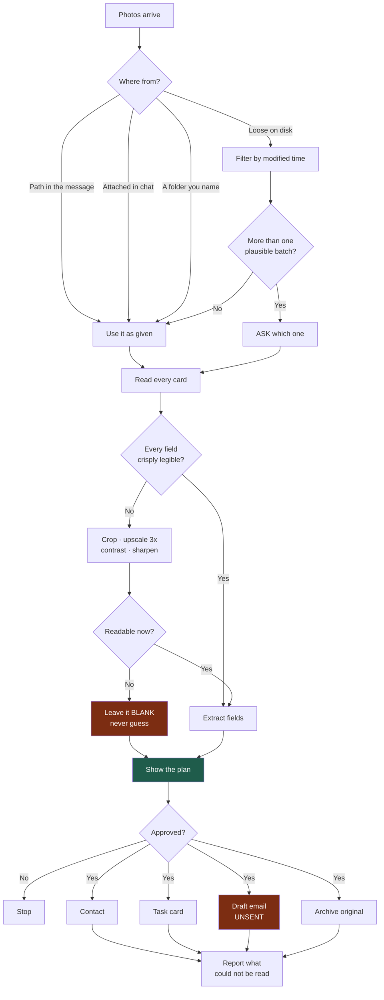
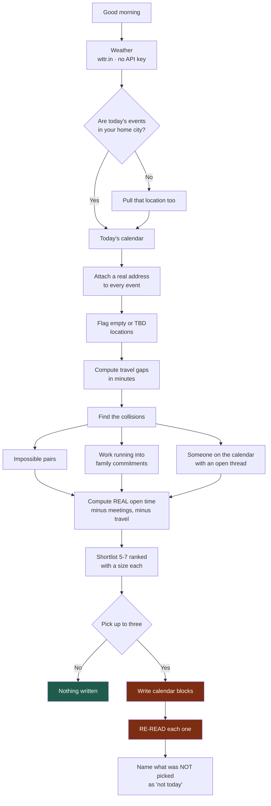
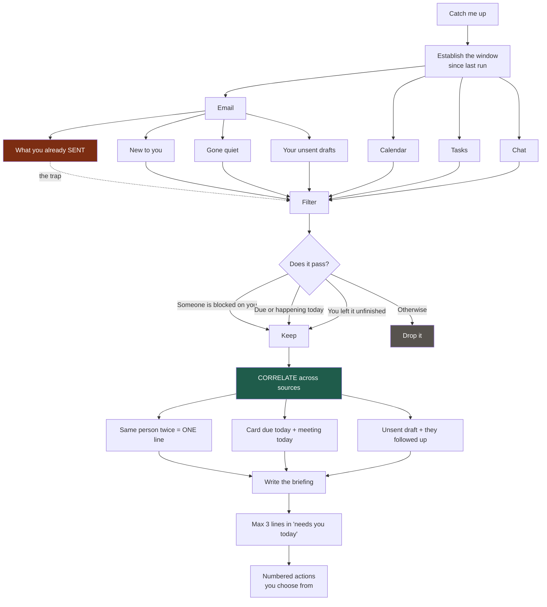
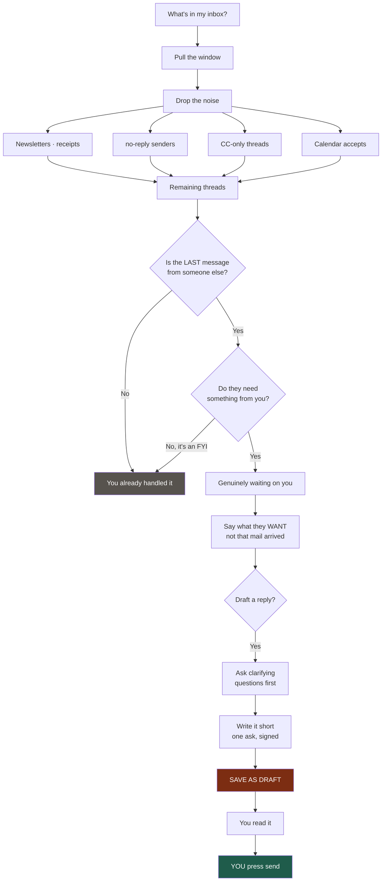

# How each skill runs

Four diagrams. The thing to watch in each: where the read-only part ends and the
writing starts.

## Business cards

A photo becomes five things. The interesting decision is in the middle — what
happens when a field can't be read.

**The rule that matters:** a guessed email address is worse than a blank one. A
blank field is a question you know to ask. A wrong one is a message that
silently never arrives.

## Morning plan

Everything is read-only until the last step. The plan is proposed, not written.

**The rule that matters:** most morning plans fail because they pretend the day
is empty. Subtract the meetings *and* the driving before proposing anything.

## Daily briefing

Four sources read into one context. The reason they're read together is the
correlation step — no single source can see those connections.

**The rule that matters:** read your own sent mail first. Your reply often lands
in a brand-new thread, so the original still looks like it's waiting on you. A
briefing that says "Adam is blocked on you" two hours after you answered him
destroys trust in the whole report.

## Email triage

The one place where the boundary is absolute.

**The rule that matters:** the assistant drafts, the human sends. Not because
the drafts are bad — because a sent email cannot be unsent, and the one time it
gets the tone wrong is the time it goes to the person who matters most.
